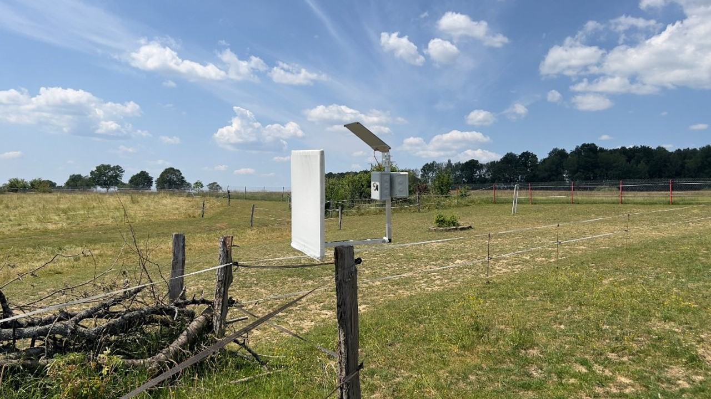
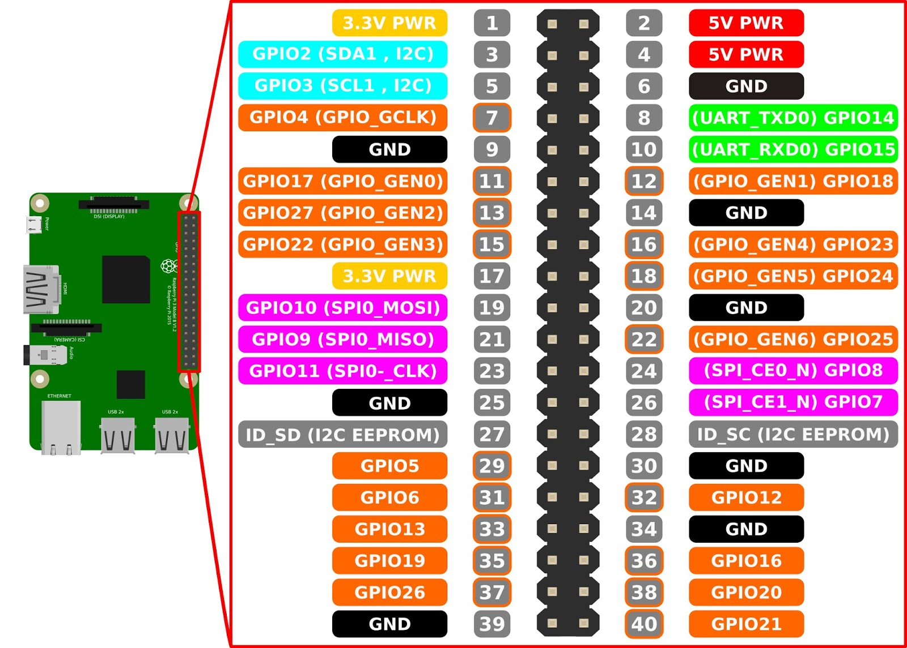

```
████████████████████████████████████████████████████████████████

███╗   ███╗ ██████╗ ████████╗██╗  ██╗ ██████╗ █████╗ ███╗   ███╗
████╗ ████║██╔═══██╗╚══██╔══╝██║  ██║██╔════╝██╔══██╗████╗ ████║
██╔████╔██║██║   ██║   ██║   ███████║██║     ███████║██╔████╔██║
██║╚██╔╝██║██║   ██║   ██║   ██╔══██║██║     ██╔══██║██║╚██╔╝██║
██║ ╚═╝ ██║╚██████╔╝   ██║   ██║  ██║╚██████╗██║  ██║██║ ╚═╝ ██║
╚═╝     ╚═╝ ╚═════╝    ╚═╝   ╚═╝  ╚═╝ ╚═════╝╚═╝  ╚═╝╚═╝     ╚═╝

████████████████████████████████████████████████████████████████
```

# MOTTIE — Moth Optical Tracking and Taxonomic Identification Equipment

MOTTIE is a Raspberry Pi based field device that attracts moths with a UV
panel, photographs them with an OAK-1 camera, classifies the species with an
on-device ML model, and uploads the results to Azure (Data Lake + IoT Hub).




## Features

- **OAK-1 (DepthAI) RGB camera** for high-resolution single-frame capture.
- **UV Neopixel panel** to attract moths and a **white Neopixel ring flash**
  that briefly illuminates the subject for the shutter.
- **On-device classification** with TensorFlow (`models/model.pb`) or ONNX
  Runtime (`models/model.onnx`).
- **Azure IoT Hub Direct Methods** to control the device remotely:
  `photo`, `analyze`, `uv`, `flash`, `unattended`.
- **Azure Data Lake Storage Gen2** upload of every captured image.
- **Unattended mode**: takes a photo every 5 minutes until stopped.
- Runs as a **systemd service** for unattended overnight operation.

## Hardware

- Raspberry Pi (ARM64; tested on Pi 4 / 64-bit OS).
- Luxonis OAK-1 camera (USB).
- Neopixel WS2812B ring (12 px) — camera flash.
- Neopixel WS2812B panel (60 px) — UV attractor.
- Optional: UUGear WittyPi 4 for scheduled power on/off.

The Pi GPIO pinout used by the LEDs (`board.D18` for the flash,
`board.D21` for the UV panel) is documented here:



## Software setup

The project targets Python 3.9+ on Raspberry Pi OS.

### 1. ArduCam / IMX519 driver (only if using the ArduCam Pivariety lens)

```bash
wget -O install_pivariety_pkgs.sh https://github.com/ArduCAM/Arducam-Pivariety-V4L2-Driver/releases/download/install_script/install_pivariety_pkgs.sh
chmod +x install_pivariety_pkgs.sh
./install_pivariety_pkgs.sh -p libcamera_dev
./install_pivariety_pkgs.sh -p libcamera_apps
./install_pivariety_pkgs.sh -p imx519_kernel_driver_low_speed
sudo reboot
```

### 2. OAK-1 USB udev rule (required for camera access)

```bash
echo 'SUBSYSTEM=="usb", ATTRS{idVendor}=="03e7", MODE="0666"' | sudo tee /etc/udev/rules.d/80-movidius.rules
sudo udevadm control --reload-rules && sudo udevadm trigger
```

### 3. Python dependencies

```bash
pip3 install -r requirements.txt
```

ML inference dependencies (`tensorflow`, `onnxruntime`) are commented out
in `requirements.txt` and only needed when `ENABLE_INFERENCE=true`.

### 4. (Optional) Jupyter for interactive experiments

```bash
sudo apt-get update
sudo apt-get install -y python3-matplotlib python3-scipy
sudo pip3 install jupyter
sudo jupyter-notebook --ip <pi-ip> --allow-root
```

## Configuration

All Azure credentials and camera defaults live in environment variables.
Copy the template and fill in your own values:

```bash
cp .env.example .env
# then edit .env with your IoT Hub connection string and Storage Account key
```

`.env` is git-ignored and must never be committed. The application loads
it via `python-dotenv` at startup.

| Variable | Description |
|----------|-------------|
| `IOT_HUB_CONNECTION_STRING`     | Device-scoped IoT Hub connection string. |
| `STORAGE_ACCOUNT_NAME`          | Azure Storage / Data Lake account name. |
| `STORAGE_ACCOUNT_KEY`           | Account access key. |
| `STORAGE_ACCOUNT_CONTAINER_NAME`| Blob container (default: `mothcam`). |
| `STORAGE_ACCOUNT_DIRECTORY_NAME`| Directory inside the container (default: `upload`). |
| `IMAGE_WIDTH` / `IMAGE_HEIGHT`  | Capture resolution. |
| `IMAGE_FORMAT`                  | OAK-1 colour format (default: `RGB888`). |
| `FILENAME_PREFIX`               | Prefix for captured images. |
| `ENABLE_IOT`                    | `true` to connect to IoT Hub on startup. |
| `ENABLE_INFERENCE`              | `true` to load the on-device classifier. |

## ML models

The model binaries are **not** checked in (they are gitignored). Place the
files exported from your training pipeline at:

```
models/model.onnx     # ONNX Runtime classifier
models/model.pb       # TensorFlow frozen graph (Custom Vision export)
models/labels.txt     # Class labels, one per line  (committed)
```

## Running

```bash
python3 main.py
```

The banner prints the available IoT Hub direct methods and the unattended
thread starts automatically (one photo every 5 minutes until stopped).

## Direct methods

When `ENABLE_IOT=true`, the device responds to the following IoT Hub
direct methods:

| Method        | Effect |
|---------------|--------|
| `photo`       | Capture a single photo and upload it to the Data Lake. |
| `analyze`     | Capture, upload, classify; returns the image URL and label. |
| `uv`          | Run the UV panel through a rainbow cycle, then back to UV. |
| `flash`       | Strobe the white flash 10 times. |
| `unattended`  | Toggle the periodic capture thread on/off. |

## Deployment as a systemd service

```bash
# 1. Stop the service if it is already running
sudo systemctl stop mottie

# 2. Copy the service file to the systemd directory
sudo cp /home/moth/mothcam/mottie.service /etc/systemd/system/

# 3. Reload the systemd daemon
sudo systemctl daemon-reload

# 4. Enable the service so it starts at boot
sudo systemctl enable mottie

# 5. Start the service
sudo systemctl start mottie

# 6. Check the status
sudo systemctl status mottie

# 7. (Optional) Tail the live logs
sudo journalctl -u mottie -f
```

The systemd unit (`mottie.service`) runs as user `moth` and invokes
`/home/moth/start_mottie.sh`, which exports `PYTHONPATH` for the user-site
packages required by Neopixel and launches `main.py`.

## Project structure

```
.
├── main.py              # entry point; logging + service startup
├── config.py            # environment-driven configuration
├── camera.py            # OAK-1 (DepthAI) capture wrapper
├── flash.py             # white Neopixel ring (camera flash)
├── uv.py                # UV Neopixel panel
├── unattended.py        # periodic capture thread
├── iotclient.py         # IoT Hub direct-method dispatcher
├── datalake.py          # Azure Data Lake upload helper
├── tensor.py            # TensorFlow classifier
├── onnx.py              # ONNX Runtime classifier
├── utils.py             # filenames + image preprocessing
├── test_oak1_camera.py  # manual smoke test for the camera
├── tensorflow.ipynb     # notebook used during model development
├── mottie.service       # systemd unit
├── start_mottie.sh      # launcher invoked by systemd
├── docs/                # supporting documentation (GPIO pinout, ...)
├── models/              # ML models (binaries gitignored, labels.txt committed)
├── samples/             # reference moth images
├── images/              # captured photos (gitignored)
└── rpi_ws281x/          # vendored Neopixel helpers
```

## License

Released under the MIT License — see [`LICENSE.md`](LICENSE.md).

Copyright (c) Dr. Ameli Kirse (LIB), Tillmann Eitelberg (oh22).
